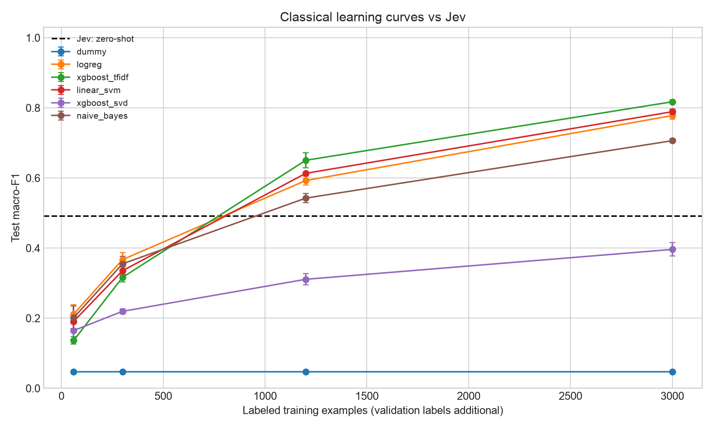
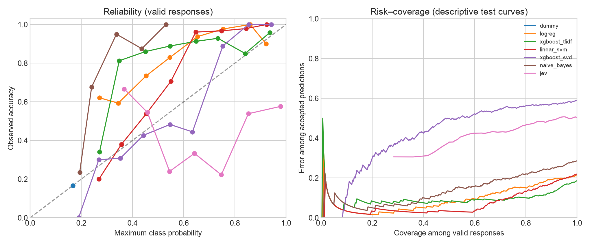

# Classifier benchmark report

Dataset: **Emotion (6 emotions in English tweets)** — `dair-ai/emotion` at Hub revision `cab853a1dbdf4c42c2b3ef2173804746df8825fe`.

Public/custom dataset benchmark; inspect the caveats before publishing.

| Model | Train labels | Seed | Test accuracy | Macro-F1 | Failed | p50 ms | p95 ms |
|---|---:|---:|---:|---:|---:|---:|---:|
| dummy | 60 | 11 | 0.167 | 0.048 | 0 | 0.12 | 0.13 |
| logreg | 60 | 11 | 0.217 | 0.212 | 0 | 0.15 | 0.17 |
| xgboost_tfidf | 60 | 11 | 0.157 | 0.133 | 0 | 0.24 | 0.27 |
| linear_svm | 60 | 11 | 0.210 | 0.203 | 0 | 1.10 | 1.18 |
| xgboost_svd | 60 | 11 | 0.170 | 0.133 | 0 | 0.26 | 0.28 |
| naive_bayes | 60 | 11 | 0.197 | 0.190 | 0 | 0.17 | 0.18 |
| xgboost_tfidf | 300 | 11 | 0.300 | 0.306 | 0 | 0.23 | 0.26 |
| linear_svm | 300 | 11 | 0.377 | 0.350 | 0 | 1.10 | 1.14 |
| dummy | 300 | 11 | 0.167 | 0.048 | 0 | 0.12 | 0.13 |
| naive_bayes | 300 | 11 | 0.343 | 0.340 | 0 | 0.18 | 0.19 |
| logreg | 300 | 11 | 0.350 | 0.348 | 0 | 0.15 | 0.17 |
| xgboost_svd | 300 | 11 | 0.227 | 0.209 | 0 | 0.32 | 0.36 |
| xgboost_tfidf | 1200 | 11 | 0.627 | 0.634 | 0 | 0.24 | 0.27 |
| xgboost_svd | 1200 | 11 | 0.293 | 0.291 | 0 | 0.43 | 0.47 |
| dummy | 1200 | 11 | 0.167 | 0.048 | 0 | 0.12 | 0.13 |
| naive_bayes | 1200 | 11 | 0.557 | 0.549 | 0 | 0.21 | 0.23 |
| logreg | 1200 | 11 | 0.583 | 0.582 | 0 | 0.15 | 0.17 |
| linear_svm | 1200 | 11 | 0.617 | 0.616 | 0 | 1.10 | 1.19 |
| linear_svm | 3000 | 11 | 0.780 | 0.781 | 0 | 1.10 | 1.17 |
| naive_bayes | 3000 | 11 | 0.713 | 0.711 | 0 | 0.22 | 0.24 |
| logreg | 3000 | 11 | 0.790 | 0.789 | 0 | 0.16 | 0.17 |
| xgboost_svd | 3000 | 11 | 0.410 | 0.418 | 0 | 0.46 | 0.51 |
| xgboost_tfidf | 3000 | 11 | 0.813 | 0.813 | 0 | 0.24 | 0.27 |
| dummy | 3000 | 11 | 0.167 | 0.048 | 0 | 0.12 | 0.14 |
| xgboost_svd | 60 | 22 | 0.210 | 0.164 | 0 | 0.26 | 0.29 |
| naive_bayes | 60 | 22 | 0.250 | 0.248 | 0 | 0.17 | 0.18 |
| dummy | 60 | 22 | 0.167 | 0.048 | 0 | 0.12 | 0.13 |
| logreg | 60 | 22 | 0.247 | 0.245 | 0 | 0.16 | 0.18 |
| linear_svm | 60 | 22 | 0.217 | 0.208 | 0 | 1.10 | 1.16 |
| xgboost_tfidf | 60 | 22 | 0.173 | 0.151 | 0 | 0.23 | 0.27 |
| linear_svm | 300 | 22 | 0.373 | 0.332 | 0 | 1.11 | 1.16 |
| xgboost_tfidf | 300 | 22 | 0.323 | 0.335 | 0 | 0.23 | 0.25 |
| xgboost_svd | 300 | 22 | 0.243 | 0.225 | 0 | 0.32 | 0.36 |
| logreg | 300 | 22 | 0.400 | 0.395 | 0 | 0.16 | 0.17 |
| naive_bayes | 300 | 22 | 0.387 | 0.385 | 0 | 0.18 | 0.19 |
| dummy | 300 | 22 | 0.167 | 0.048 | 0 | 0.12 | 0.13 |
| xgboost_tfidf | 1200 | 22 | 0.630 | 0.637 | 0 | 0.24 | 0.27 |
| xgboost_svd | 1200 | 22 | 0.333 | 0.331 | 0 | 0.44 | 0.48 |
| dummy | 1200 | 22 | 0.167 | 0.048 | 0 | 0.12 | 0.13 |
| linear_svm | 1200 | 22 | 0.617 | 0.613 | 0 | 1.12 | 1.18 |
| logreg | 1200 | 22 | 0.617 | 0.610 | 0 | 0.16 | 0.17 |
| naive_bayes | 1200 | 22 | 0.530 | 0.524 | 0 | 0.22 | 0.24 |
| xgboost_tfidf | 3000 | 22 | 0.813 | 0.814 | 0 | 0.23 | 0.27 |
| dummy | 3000 | 22 | 0.167 | 0.048 | 0 | 0.12 | 0.14 |
| naive_bayes | 3000 | 22 | 0.703 | 0.699 | 0 | 0.23 | 0.25 |
| logreg | 3000 | 22 | 0.780 | 0.780 | 0 | 0.16 | 0.18 |
| xgboost_svd | 3000 | 22 | 0.393 | 0.399 | 0 | 0.46 | 0.50 |
| linear_svm | 3000 | 22 | 0.800 | 0.800 | 0 | 1.14 | 1.22 |
| xgboost_svd | 60 | 33 | 0.200 | 0.197 | 0 | 0.25 | 0.28 |
| logreg | 60 | 33 | 0.180 | 0.178 | 0 | 0.16 | 0.17 |
| xgboost_tfidf | 60 | 33 | 0.137 | 0.126 | 0 | 0.23 | 0.26 |
| naive_bayes | 60 | 33 | 0.170 | 0.167 | 0 | 0.17 | 0.19 |
| dummy | 60 | 33 | 0.167 | 0.048 | 0 | 0.12 | 0.13 |
| linear_svm | 60 | 33 | 0.163 | 0.162 | 0 | 1.14 | 1.19 |
| xgboost_svd | 300 | 33 | 0.237 | 0.225 | 0 | 0.32 | 0.35 |
| dummy | 300 | 33 | 0.167 | 0.048 | 0 | 0.12 | 0.16 |
| logreg | 300 | 33 | 0.367 | 0.359 | 0 | 0.16 | 0.19 |
| xgboost_tfidf | 300 | 33 | 0.310 | 0.308 | 0 | 0.23 | 0.32 |
| linear_svm | 300 | 33 | 0.340 | 0.325 | 0 | 1.17 | 1.28 |
| naive_bayes | 300 | 33 | 0.350 | 0.341 | 0 | 0.19 | 0.20 |
| naive_bayes | 1200 | 33 | 0.557 | 0.555 | 0 | 0.22 | 0.24 |
| xgboost_tfidf | 1200 | 33 | 0.677 | 0.680 | 0 | 0.24 | 0.28 |
| dummy | 1200 | 33 | 0.167 | 0.048 | 0 | 0.12 | 0.14 |
| logreg | 1200 | 33 | 0.590 | 0.586 | 0 | 0.16 | 0.18 |
| linear_svm | 1200 | 33 | 0.613 | 0.611 | 0 | 1.15 | 1.22 |
| xgboost_svd | 1200 | 33 | 0.310 | 0.311 | 0 | 0.43 | 0.47 |
| xgboost_tfidf | 3000 | 33 | 0.823 | 0.825 | 0 | 0.23 | 0.28 |
| xgboost_svd | 3000 | 33 | 0.373 | 0.372 | 0 | 0.45 | 0.50 |
| linear_svm | 3000 | 33 | 0.787 | 0.787 | 0 | 1.17 | 1.24 |
| naive_bayes | 3000 | 33 | 0.713 | 0.709 | 0 | 0.23 | 0.25 |
| dummy | 3000 | 33 | 0.167 | 0.048 | 0 | 0.12 | 0.14 |
| logreg | 3000 | 33 | 0.767 | 0.765 | 0 | 0.16 | 0.18 |
| jev | 0 | 0 | 0.497 | 0.491 | 0 | 252.01 | 369.20 |

## How to read these results

Classical models use training labels plus the fixed validation labels to choose hyperparameters. Jev receives category descriptions only. Training budgets exclude validation labels. Learning-curve bars show standard deviation across training-subset seeds, not confidence intervals over independent datasets.

The calibration plots use the largest training budget and the first seed for each model. Brier score (sum across classes), log loss, 10-bin ECE, per-class recall, confusion matrices, and per-run accuracy bootstrap intervals are in results.json. Bootstrap intervals are conditional on this fitted model and test sample; they do not capture training or dataset uncertainty.

Failures count as wrong in headline accuracy and macro-F1. Probability diagnostics use valid responses only; check failure counts before comparing those diagnostics. Risk–coverage curves describe the held-out test set; they do not select deployable thresholds. Jev confidence is logged separately and is not treated as a correctness probability.

Latency is sequential single-example wall time. Local models include vectorization after one warm-up; Jev includes network time, its first request, retries and backoff. These are deployment timings, not an equal-hardware architecture comparison. Runs are not cached. Training/tuning time is reported separately in results.json.

## Cost and limits

Local compute, labeling and engineering costs are not assumed to be zero. Jev token charges are estimated only if you supply current prices. Retry billing and missing usage can make that estimate a lower bound. No aggregate cost-per-correct claim is made from incomplete billing data.

Inspect metadata.json for dataset hashes, configuration, software versions and machine information. Predictions are in predictions.jsonl, including errors and Jev's raw response/usage when available. Well-known public datasets may overlap foundation-model pretraining, which can favour Jev; exact duplicates are removed but near-duplicates may remain. Use a private or newly collected labeled holdout before making broad claims.

Jev cost metadata: `{'known_response_token_cost_usd': 0.006057575999999999, 'records_missing_usage': 0, 'unaccounted_retry_attempts': 0, 'note': 'Token-only estimate; unknown attempt charges and local compute excluded'}`.
